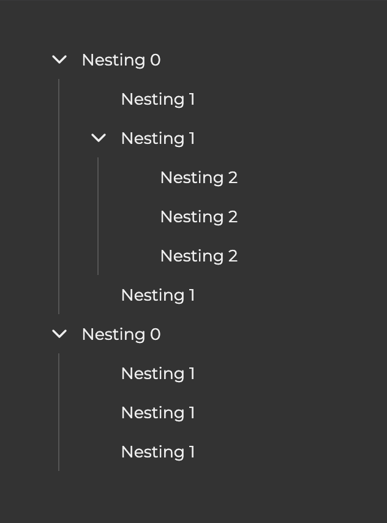

# React Storybook Assessment

Stories are located in the `src/stories` directory. They showcase three components.

### `Input`

A flexible input field supporting text, password, and number. Password fields include a visibility toggle, and the clearable option adds a small reset button. Storybook shows variants for all input types, with and without the clear button.


### `Toast`

A small notification that appears in the bottom-right corner, fades/slides in, and auto-dismisses after the set duration. Manual close is available. Storybook includes all toast types, duration examples, and configurations with a close button.


### `Sidebar`

A sliding menu that supports nested items via expandable sections. It closes when the backdrop is clicked. Storybook demonstrates menus with one-level and multiple-level nesting, including open and closed states.




## Setup

Run the following commands:

```bash
npm i
npm run storybook
```
